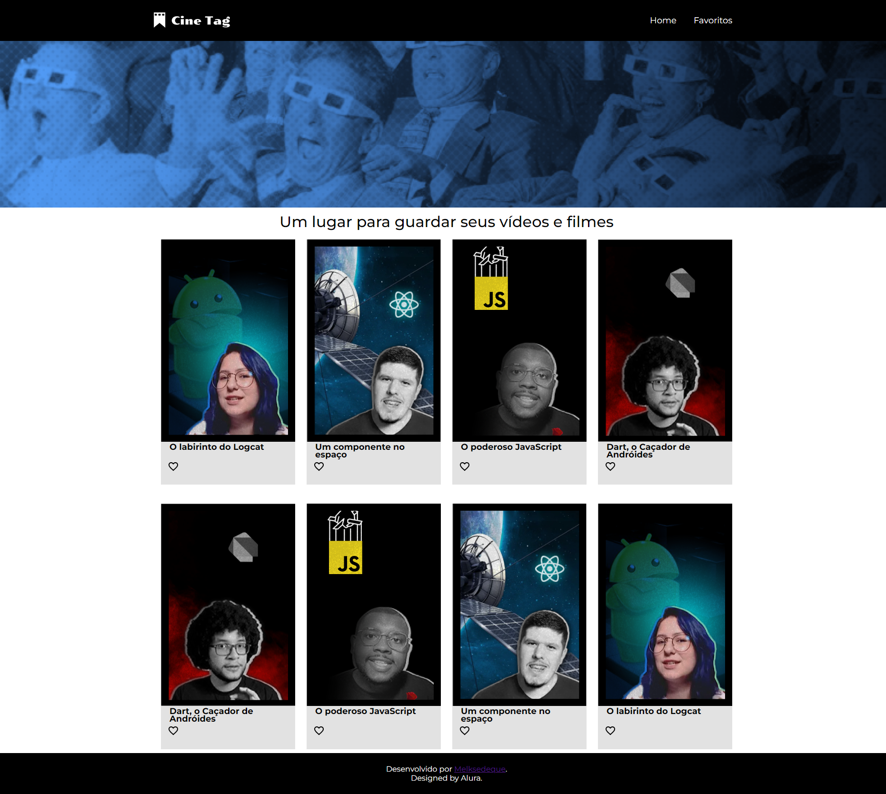

# Projeto Cine Tag - React

Cine Tag é uma aplicação React.JS que permite explorar, favoritar e assistir a vídeos. Com uma interface intuitiva, os usuários podem navegar entre a página inicial e a lista de favoritos, além de reproduzir vídeos diretamente na aplicação. Ideal para praticar React, gerenciamento de estado e consumo de APIs.



## Menu

- [Layout](#layout)
- [Descrição](#descrição)
  - [Principais recursos incluem](#principais-recursos-incluem)
  - [Proximos passos de desenvolvimento](#proximos-passos-de-desenvolvimento)
- [Tecnologias Utilizadas](#tecnologias-utilizadas)
- [Estrutura de Pastas](#estrutura-de-pastas)
  - [Arquivos Principais](#arquivos-principais)
- [Como Instalar e Rodar o Projeto](#como-instalar-e-rodar-o-projeto)
  - [Configuração](#configuração)
  - [Casos de Uso Comuns](#casos-de-uso-comuns)
  - [Solução de Problemas](#solução-de-problemas)
- [Projeto ao Vivo](#projeto-ao-vivo)
- [Fluxo de Dados](#fluxo-de-dados)
- [Licença](#licença)
- [Autor](#autor)

## Layout

[Layout no Figma](<https://www.figma.com/design/VU8mCwoKVV6vS7s1FYV05m/React%3A-Praticando-React-com-Js-%7C-Cinetag-(Community)?node-id=12-2&p=f&t=tRyaWwMTakj5MTSU-0>)

## Descrição

O **Cine Tag** é uma aplicação web que consome uma API de vídeos, permitindo aos usuários explorar, favoritar e assistir a vídeos. A aplicação foi desenvolvida em React.JS e utiliza tecnologias modernas para garantir uma experiência fluida e responsiva.

### Principais recursos incluem:

- **Página inicial** com cards de vídeos, exibindo informações como título, capa e descrição.
- **Sistema de favoritos:** os usuários podem favoritar ou desfavoritar vídeos clicando em um ícone de coração.
- **Navegação intuitiva:** roteamento entre as páginas Home e Favoritos.
- **Página de player:** ao clicar em um card, o vídeo é reproduzido em uma página dedicada.

### Proximos passos de desenvolvimento

- Melhorar o layout seguindo o criado no Figma;
- Criar a responsividade da aplicação;
- Adicionar autenticação de usuários para personalizar a experiência;
- Implementar busca e filtragem de vídeos por categoria ou título;
- Integrar uma API de vídeos real (ex: YouTube, Vimeo);
- Adicionar testes unitários e de integração;
- Melhorar a acessibilidade da aplicação;

## Tecnologias Utilizadas

- **React.js:** Biblioteca principal para construção da interface.
- **React Router DOM:** Gerenciamento de rotas e navegação.
- **Vite:** Ferramenta de build rápida e moderna.
- **CSS Modules:** Estilização modularizada para evitar conflitos.
- **ESLint:** Padronização e qualidade do código.
- **My JSON Server:** Simulação de API para dados de vídeos.

## Estrutura de Pastas

```
src/
  ├── components/     # Componentes reutilizáveis
  ├── contexts/      # Contextos React (ex: Favoritos)
  ├── pages/         # Páginas da aplicação
  └── main.jsx       # Ponto de entrada da aplicação
```

### Arquivos Principais:

- `src/routes.jsx` - Configuração das rotas da aplicação
- `src/contexts/Favoritos.jsx` - Contexto para gerenciar o estado dos vídeos favoritos

## Como Instalar e Rodar o Projeto

1. Clone o repositório

```bash
git clone https://github.com/Melksedeque/cine-tag-react.git
```

2. Instale as dependências:

```bash
npm install
```

3. Execute o projeto em modo desenvolvimento:

```bash
npm run dev
```

### Configuração

- Para alterar a fonte de dados, substitua a URL da API no arquivo de configuração.
- Caso queira simular uma API local, utilize o db.json com o My JSON Server.

### Casos de Uso Comuns

- **Favoritar vídeos:** Clique no ícone de coração nos cards da página inicial.
- **Assistir vídeos:** Clique em um card para abrir o player.
- **Navegar entre páginas:** Use o menu de navegação no cabeçalho.

### Solução de Problemas

- **Erro ao carregar vídeos:** Verifique a conexão com a API ou o arquivo db.json.
- **Problemas de estilo:** Certifique-se de que os módulos CSS estão corretamente importados.

## Projeto ao Vivo

Acesse a versão online do projeto [aqui](https://cine-tag-react-two.vercel.app).

## Fluxo de Dados

1. A aplicação consome a API de vídeos (https://my-json-server.typicode.com/Melksedeque/cine-tag-react/videos).
2. Os vídeos são exibidos na página inicial.
3. Ao favoritar um vídeo, ele é adicionado ao contexto de favoritos.
4. Os vídeos favoritos são exibidos na página "Favoritos".
5. Ao clicar em um vídeo, o usuário é redirecionado para a página de player, onde o vídeo é reproduzido.

## Licença

Este projeto está licenciado sob a Licença MIT. Veja o arquivo [LICENSE](https://github.com/Melksedeque/cine-tag-react?tab=MIT-1-ov-file) para mais detalhes.

## Autor

- GitHub - [Melksedeque Silva](https://github.com/Melksedeque/)
- FrontEndMentor - [@Melksedeque](https://www.frontendmentor.io/profile/Melksedeque)
- Twitter / X - [@SouzaMelk](https://x.com/SouzaMelk)
- LinkedIn - [Melksedeque Silva](https://www.linkedin.com/in/melksedeque-silva/)
